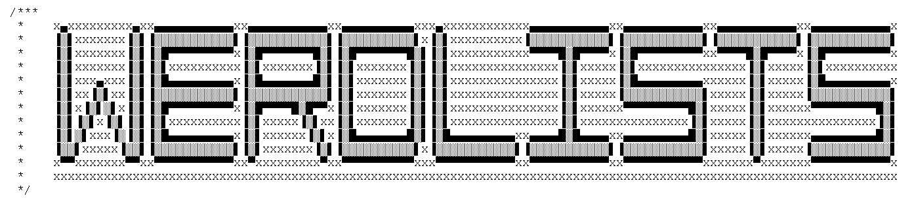

* * *

* * *

# "Word Lists" for Software Security Test Cases

> Word lists, Dictionary Files, Attack Strings, Miscellaneous Datasets and Proof-of-Concept Test Cases With a Collection of Tools for Penetration Testers 

<!-- WARNING<b>:</b> REPOSITORY IS NEARING 1GB -->

* <a href="#intro">Brief Introduction to `werdlists`</a>
* <a href="#inspire">Inspiration Taken from Similar Projects</a>
  - <a href="#unique">Unique Features Only Available With `werdlists`</a>
* <a href="#repo">Repository Directory Hierarchy and Structure</a>
  - <a href="#naming">Naming Scheme, Syntax and Meaning</a>
* <a href="#contents">Folder Names and Description of Contents</a>

## Brief Introduction to `werdlists` :scissors:

This project is a collection of word lists--they are mostly [whitespace-delimited](https://wikipedia.org/wiki/String_literal#Whitespace_delimiters)
or line-based.  Although the [`passes-dicts`](passes-dicts "Password Dictionaries") folder contains inputs for [password cracking](https://wikipedia.org/wiki/Password_cracking),
overall the files amassed here are intended to be useful in facilitating
the creation of insecure [program state](https://wikipedia.org/wiki/State_(computer_science)#Program_state) (with the help of a [black-box fuzzer](https://wikipedia.org/wiki/Fuzzing#Types_of_fuzzers) or scanning
tool.)  The vast majority of files are simply [ASCII](https://wikipedia.org/wiki/ASCII "American Standard Code for Information Interchange") with the [UNIX](http://unix.org/what_is_unix.html)
style [newline](https://wikipedia.org/wiki/Newline).   

## Inspiration Taken From Similar Projects :thought_balloon:
`werdlists` is very similar to [`fuzzdb`](/fuzzdb-project/fuzzdb/ "The attack pattern dictionary") and 
[`SecLists`](/danielmiessler/SecLists/ "The security tester's companion").  `SecLists` is maintained by my former colleague at [IOActive](https://ioactive.com "IOActive"), [Daniel Miessler](https://danielmiessler.com).
Admittedly, `werdlists` is quite similar in mission as it's a centralized attack strings 
and [input](https://wikipedia.org/wiki/Input_(computer_science)) data resource.  Regardless, `werdlists` expands on a number of concepts: it has its own unique style, organization, 
original hand-crafted contents, dataset creation/management/validation scripts, scanner springboards, etc.

### Unique Features Only Available With `werdlists` :100: 
`werdlists` cross-references between the code repositories of third-party scanners and its own datasets folders each tool will benefit from.
Moreover, there are specialized parsing scripts exclusive to `werdlists` that extract results produced through pairing test tools with its own data.  Output 
strings are gathered from those results and fed back into the test tools.  In other words, there are a number of interactive and/or
tunable feedback loops implemented.  Quite a few of the `werdlists` data files were created this way.

## Repository Directory Hierarchy and Structure :nut_and_bolt:

The [`scripts`](scripts) folder consists of [shell scripts](https://www.shellscript.sh "Shell Scripting Tutorial") used for repository maintenance.
There is a sub-directory of `scripts` called `init` where scripts that generate data files are kept.  If a script filename stored in `init` contains
two dashes, then it's output should reflect the contents of the associated data file.  For example, compare [`manpages-environ`](/decal/werdlists/scripts/init/manpages-environ) 
and [`clib-package-names`](/decal/werdlists/scripts/init/clib-package-names).  All scripts were written using bash syntax.
The [`contrib`](/decal/werdlists/scripts/contrib) folder is for storing scripts contributed via pull request and the [`utils`](/decal/werdlists/scripts/utils) 
folder contains utilities that aren't necessarily specific to the `werdlists` project, such as scripts for managing any wordlist file.
Other data files were manually composed by hand and a small handful were created by recycling output strings back into input parameter lists, i.e. [`dirbdirs-feedback`](/decal/werdlists/scripts/init/dirbdirs-feedback)
The [`tools`](tools) folder lists security tools that the datasets contained in this repository can be provided as input for.
Individual folders are detailed in the <a href="#contents">Folder Names and Description of Contents</a> section below.
All files in each dataset directory are detailed in the local `README.md` file for that folder
(as opposed to the global `README.md` in the root directory being read now.)

### Naming Scheme, Syntax and Meaning :speech_balloon:

Most files have the `*.txt` extension signifying the `text/plain` [MIME type](https://wikipedia.org/wiki/Media_type)
Often used formats besides plain text include: [Comma-Separated Values](https://wikipedia.org/wiki/Comma-separated_values) (`text/csv`), 
[Extended Markup Language](https://wikipedia.org/wiki/XML) (`application/xml`),
[Hyper Text Markup Language](https://wikipedia.org/wiki/HTML) (`application/html`), etc.
Any file that is larger than 1MB uncompressed will be compressed with [xz](https://wikipedia.org/wiki/Xz)
according to the commands in the [`scripts/xzlarge-files`](/decal/werdlists/scripts/xzlarge-files) bash script.  Other file extensions in use are:
`*.ans`, `*.asc`, `*.bin`, `*.c`, `*.conf`, `*.cpp`, `*.csv`, `*.html`, `*.inf`, `*.ini`, `*.json`, `*.md`, `*.rpz`, `*.rst`, `*.sh`, `*.txt`, `*.xml`, `*.yaml`, `*.yml`, `*.zip`, and `*.zone`.

## Folder Names and Description of Contents :clipboard:

|&nbsp;&nbsp;&nbsp;&nbsp;_Folder&nbsp;&nbsp;Name_&nbsp;&nbsp;&nbsp;&nbsp;| _Description of Contents_
|:----------------|---------------------------------------------------------------------------------------------------------------------------------------------------------------------------------------------------------------------------------------------
| [apple-paths](apple-paths)     | :rocket: Pathnames found on MacOS file systems   
| [apple-data](apple-data)       | :apple: Data identifiers and such from Apple's MacOS operating system  
| [arpa-headers](arpa-headers)    | :email: Header fields transmitted over [RFC2822](https://tools.ietf.org/html/rfc2822) style protocols like [SMTP](https://wikipedia.org/wiki/Simple_Mail_Transfer_Protocol)  
| [ascii-art](ascii-art)       | :art: "Low bit" a.k.a. 7-bit [ASCII art](https://wikipedia.org/wiki/ASCII_art) items without [control characters](https://wikipedia.org/wiki/Control_character)  
| [biology-info](biology-info)    | :microscope: Reference information useful in the study of biological issues  
| [browser-data](browser-data)    | :door: Data related to GUI browser software like [Chrome](https://google.com/chrome/ "Chrome Web Browser"), [FireFox](https://www.mozilla.org/en-US/firefox/new/ "Download FireFox"), etc.  
| [cert-data](cert-data)       | :scroll: Information commonly utilized by cryptographic certificate materials  
| [char-encodes](char-encodes)    | :ideograph_advantage: Various [character encodings](https://w3.org/International/articles/definitions-characters/ "Character encodings: Essential concepts") provided by different [locales](https://wikipedia.org/wiki/Locale_(computer_software) "Locale (computer software)")/[charsets](https://w3.org/International/articles/http-charset/index "Setting the HTTP charset parameter")  
| [char-sequence](char-sequence) | :black_nib: various character sequences modeled after [ctype.h](https://wikibooks.org/wiki/C_Programming/ctype.h "character types header in the ANSI C standard library")  
| [chat-data](chat-data)       | :open_mouth: Additional data on [IRC](https://wikipedia.org/wiki/Internet_Relay_Chat), [XMPP](https://wikipedia.org/wiki/XMPP) and other such messaging protocols  
| [cipher-data](cipher-data)     | :blowfish: Data denoting or used by [cryptographic algorithm](https://wikipedia.org/wiki/Category:Cryptographic_algorithms) implementations  
| [cmd-usage](cmd-usage)       | :hammer: Help text shown in a terminal when attempting to execute [CLI](https://wikipedia.org/wiki/Command-line_interface "Command-line interface") programs  
| [code-keywords](code-keywords)   | :coffee: [Computer language](https://wikipedia.org/wiki/Computer_language) identifiers, [reserved words](https://wikipedia.org/wiki/Reserved_word) and similar syntax  
| [cpu-arch](cpu-arch)        | :factory: Low-level [computer architecture](https://wikipedia.org/wiki/Computer_architecture) and hardware subjects  
| [crypt-output](crypt-output)    | :sparkles: Cipher text string outputs created by [cryptographic hash functions](https://wikipedia.org/wiki/Cryptographic_hash_function)  
| [database-strs](database-strs)   | :floppy_disk: Strings often encountered when working with [database](https://wikipedia.org/wiki/Database) software  
| [dns-domains](dns-domains)     | :globe_with_meridians: A list of domains that may have been found in the live DNS tree at one point
| [dns-hostnames](dns-hostnames)   | :flashlight: The host name part of an [FQDN](https://wikipedia.org/wiki/Fully_qualified_domain_name "Fully Qualified Domain Name")  
| [dns-records](dns-records)     | :ticket: Data specific to [RR's](http://freesoft.org/CIE/Topics/78.htm "Resource Records") in the DNS system  
| [dns-servers](dns-servers)     | :battery: Data provided to, produced by or related to DNS name servers  
| [dns-toplevel](dns-toplevel)    | :top: TLD's or [Top Level Domains](https://wikipedia.org/wiki/Top-level_domain) in the uppermost part of the DNS hierarchy  
| [environ-vars](environ-vars)   | :tent: [Environment variable](https://wikipedia.org/wiki/Environment_variable) names, settings, etc.  
| [exploit-info](exploit-info)    | :8ball: Technical information on exploitation of security vulnerabilities  
| [file-extens](file-extens)     | :anchor: Stuff on [Filename extensions](https://wikipedia.org/wiki/Filename_extension), i.e. the part after the dot
| [file-specs](file-specs)      | :file_folder: [File format](https://wikipedia.org/wiki/File_format) specifications as distributed by vendor(s)/author(s)  
| [ftp-data](ftp-data)        | :outbox_tray: Various [FTP](https://wikipedia.org/wiki/File_Transfer_Protocol "File Transfer Protocol") datum from RFC's and elsewhere  
| [glibc-data](glibc-data)      | :gear: Data taken from the source code of the [GNU C Library](https://gnu.org/software/libc/ "glibc")  
| [html-words](html-words)      | :keyboard: Words not uncommon to come across when parsing HTML dialects  
| [http-agents](http-agents)     | :flags: Software version banners for [HTTP User Agents](https://wikipedia.org/wiki/User_agent#Use_in_HTTP "User agent - Use in HTTP") also known as browsers  
| [http-headers](http-headers)    | :cookie: Header fields sent in requests/responses by browser/server software 
| [http-methods](http-methods)    | :arrow_forward: Names [Request methods](https://wikipedia.org/wiki/Hypertext_Transfer_Protocol#Request_methods) browsers send in the first line of HTTP
| [http-params](http-params)     | :abcd: Parameters browsers sometimes send when requesting server [URI](https://wikipedia.org/wiki/Uniform_Resource_Identifier "Uniform Resource Identifier") paths  
| [http-security](http-security)   | :closed_lock_with_key: [HTTP security](https://w3.org/Protocols/rfc2616/rfc2616-sec15.html) info such as Content Security Policy
| [http-servers](http-servers)    | :office: Information related to the usage of [web server software](https://w3.org/Servers.html)  
| [http-status](http-status)     | :slot_machine: Numeric [HTTP status](https://httpstatuses.com) codes in server reply as [RFC7231](https://tools.ietf.org/html/rfc7231#section-6 "Response Status Codes") specifies
| [inet-addrs](inet-addrs)      | :electric_plug: Numeric Internet addresses a.k.a. IP addresses--mostly version 4  
| [inet-routes](inet-routes)     | :cloud: Data useful in the maintenance and use of an Internet [routing table](https://wikipedia.org/wiki/Routing_table)  
| [inet-services](inet-services)   | :fountain: Lists of Internet protocols/daemons--similar to `/etc/services`  
| [infosec-people](infosec-people)  | :neckbeard: Noteworthy individuals known from [information security communities](http://infosecevents.net/communities/)  
| [iso-codes](iso-codes)       | :heavy_check_mark: Codes, numbers and such as standardized by [ISO](https://iso.org "International Standardization Organization")  
| [java-data](java-data)       | :sunny: Data found in or related to source code of programs written with [Java](https://java.com)  
| [linux-data](linux-data)      | :keycap_ten: Data identifiers and such from the [Linux](https://opensource.com/resources/linux "What is Linux?") operating system  
| [linux-paths](linux-paths)     | :paperclips: [Pathnames](https://linuxsurvival.com/linux-pathnames/) found on [file systems](https://wikipedia.org/wiki/File_system) created by Linux installations  
| [malware-iocs](malware-iocs)    | :skull: [IOC](https://wikipedia.org/wiki/Indicator_of_compromise "Indicator of Compromise") for identification of malware infections  
| [mobile-devs](mobile-devs)      | :iphone: [Mobile device](https://wikipedia.org/wiki/Mobile_device) development for "handheld" form factors  
| [net-attacks](net-attacks)     | :hotsprings: Info about attacks on telecommunications and Internetworks  
| [net-ifaces](net-ifaces)      | :desktop_computer: Detailed information which can be extracted from network interfaces  
| [ntfs-paths](ntfs-paths)      | :open_file_folder: File [paths](https://msdn.microsoft.com/library/windows/desktop/aa365247.aspx#paths) expected to be seen in [NTFS](https://wikipedia.org/wiki/NTFS "New Technology File System") folders  
| [owasp-data](owasp-data)      | :honeybee: Data from or for [OWASP](https://www.owasp.org "Open Web Application Security Project")  
| [passes-dicts](passes-dicts)    | :key: Dictionary files for [brute-force attacks](https://wikipedia.org/wiki/Brute-force_attack) against account passwords  
| [passes-sites](passes-sites)    | :unlock: Hashed or unencrypted passwords that were publicized after the breach of a well-known site
| [perl-data](perl-data)       | :camel: Data often seen in [PERL](http://www.perl.org) (Practical Extraction and Report Language)  
| [php-data](php-data)        | :page_facing_up: Files containing information about the [PHP](http://www.php.net) programming language  
| [postal-data](postal-data)     | :mailbox_with_mail: [United States Postal Service](https://www.usps.com/) information  
| [python-data](python-data)     | :snake: Data used by the [Python](https://www.python.org/) scripting language interpreter at runtime  
| [radio-data](radio-data)      | :radio: Things commonly used in [radio frequency](https://wikipedia.org/wiki/Radio_frequency) transmissions  
| [regex-data](regex-data)      | :speech_balloon: [Regular expression](https://wikipedia.org/wiki/Regular_expression) patterns used to launch/detect attacks 
| [ruby-data](ruby-data)       | :gem: Data typically seen within the syntax of the [Ruby](https://www.ruby-lang.org) scripting language  
| [search-dorks](search-dorks)    | :mag_right: General purpose search-engine queries likely to find insecure sites  
| [smtp-messages](smtp-messages)   | :envelope: Messages (i.e. signatures, auto-replies, etc.) sent by [SMTP](https://wikipedia.org/wiki/Simple_Mail_Transfer_Protocol "Simple Mail Transfer Protocol") servers  
| [soap-messages](soap-messages)   | :incoming_envelope: [SOAP](https://wikipedia.org/wiki/SOAP "Simple Object Access Protocol") (Simple Object Access Protocol) messages  
| [social-data](social-data)     | :eyes: Sociological or [social media](https://wikipedia.org/wiki/Social_media) related data sets including logins and user names  
| [software-strs](software-strs)   | :minidisc: Strings describing [software engineering](https://wikipedia.org/wiki/Software_engineering), [programming languages](https://wikipedia.org/wiki/Programming_language), etc.  
| [string-enums](string-enums)    | :ferris_wheel: Enumerations of values that aren't too terribly unusual  
| [system-admin](system-admin)    | :necktie: System administration and [BOFH](https://wikipedia.org/wiki/Bastard_Operator_From_Hell) related materials  
| [system-notices](system-notices)  | :warning: Disclaimer/warning messages shown by networked computer systems  
| [telco-data](telco-data)      | :telephone_receiver: Voice telecommunications technologies: [POTS](https://wikipedia.org/wiki/Plain_old_telephone_service "Plain old telephone service"), [PCS](https://www.fcc.gov/wireless/bureau-divisions/mobility-division/broadband-personal-communications-service-pcs "Personal Communications Services"), [VoIP](https://wikipedia.org/wiki/Voice_over_IP "Voice over IP"), [SMS](https://wikipedia.org/wiki/SMS "Short Message Service") etc.  
| [text-files](text-files)      | :pushpin: zine articles and such like those archived at Jason Scott's [textfiles.com](https://textfiles.com)
| [text-words](text-words)      | :pencil2: Lists of words likely to be found in an actual hard copy [dictionary](https://www.merriam-webster.com)  
| [top-secret](top-secret)      | :alien: Files and/or data related to documents that were/are classified  
| [unicode-data](unicode-data)    | :symbols: [Unicode](https://unicode.org/ "The Unicode Consortium") character usage and representation  
| [unix-data](unix-data)       | :shell: Data associated with various flavors of the UNIX OS and its clones  
| [unix-paths](unix-paths)      | :file_cabinet: File path names found in various [UNIX file systems](https://wikipedia.org/wiki/Unix_File_System)  
| [uri-attacks](uri-attacks)     | :boom: Malicious URI materials specially crafted for attack targets  
| [uri-schemes](uri-schemes)     | :paperclip: Lists containing references for [URI schemes](https://iana.org/assignments/uri-schemes/uri-schemes.xhtml) (part before colon)  
| [uri-data](uri-data)        | :link: [Universal Resource Identifier](https://w3.org/Addressing/#background "Learning About URI's") related data  
| [vuln-data](vuln-data)       | :bar_chart: Information about security vulnerabilities found in server software  
| [webapp-attacks](webapp-attacks)  | :syringe: [Proof-of-concept](https://wikipedia.org/wiki/Proof_of_concept#Security) samples demonstrating attacks against web applications  
| [webapp-data](webapp-data)     | :briefcase: Data associated with applications hosted on web servers  
| [webapp-dirs](webapp-dirs)     | :bookmark_tabs: Directories related to applications running on a web server  
| [webapp-files](webapp-files)    | :card_index: Files related to applications running on a [web server](https://wikipedia.org/wiki/Web_server)  
| [webapp-paths](webapp-paths)    | :surfer: Path names related to applications running on a web server  
| [webapp-words](webapp-words)    | :thought_balloon: Words related to applications running on a web server  
| [web-sites](web-sites)       | :earth_americas: Addresses to and/or information on significant [WWW](https://wikipedia.org/wiki/World_Wide_Web) sites  
| [wifi-networks](wifi-networks)   | :satellite: [IEEE 802.11](http://ieee802.org/11/ "The Working Group for WLAN Standards") [Wi-Fi](https://wikipedia.org/wiki/Wi-Fi) network information  
| [windows-data](windows-data)    | :briefcase: Data only found within the [Microsoft Windows](https://wikipedia.org/wiki/Microsoft_Windows) series of OSes  

* * *

ans asc bin c conf cpp csv html inf ini json md rpz rst sh txt xml yaml yml zip zone
